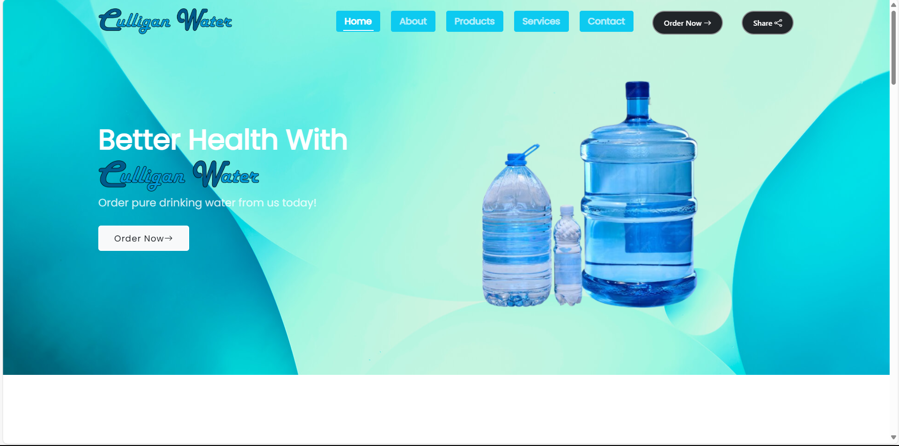
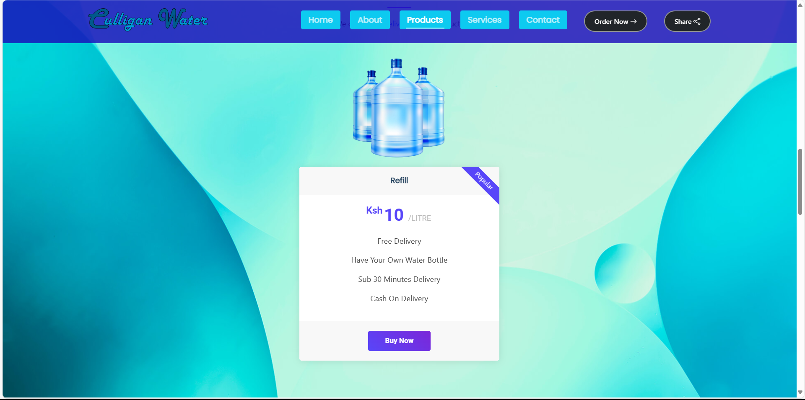

# Maji_Maji Fresh Water Delivery Web Application

Welcome to **Maji_Maji**, your go-to e-commerce platform for ordering fresh drinking water conveniently from the comfort of your home. This project aims to simplify access to clean, reliable drinking water through an intuitive online shopping experience.

---

## Features

- **User-friendly interface**: Browse and order water products effortlessly.
- **Secure transactions**: Integrated payment gateways for smooth and safe purchases.
- **Real-time order tracking**: Track your order status directly from the dashboard.
- **Responsive design**: Optimized for both desktop and mobile devices.

---

## Technology Stack

- **Frontend**: Html5, Css3, Tailwind CSS, Bootstrap
- **Backend**: Node.js, Express.js
- **Database**: MongoDB-mongoose
- **Deployment**: Vercel and VPS for the backend
- **Other Tools**:  Mongoose (data modeling)

---

## Screenshots

### Landing Page


### Products Page



## Installation

1. Clone the repository:
   ```bash
   git clone https://github.com/ElvisKemoi/MajiMajiLatest.git
   ```
2. Navigate to the project directory:
   ```bash
   cd MajiMajiLatest
   ```
3. Install dependencies:
   ```bash
   npm install
   ```
4. Start the development server:
   ```bash
   npm start
   ```

---

## Usage

1. Visit the landing page and explore the available water products.
2. Select the desired product and proceed to the checkout.
3. Complete the payment to place your order.
4. Track the order status from your account dashboard.

---

## Contributing

We welcome contributions! Feel free to fork the repository and submit a pull request with your changes.

---

## License

This project is licensed under the MIT License. See the [LICENSE](LICENSE) file for more details.

---

## Contact

For queries or feedback, contact us.


Happy hydrating! 💧

